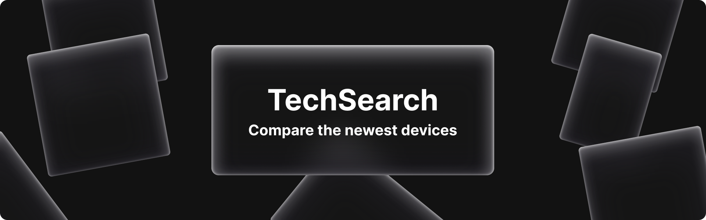
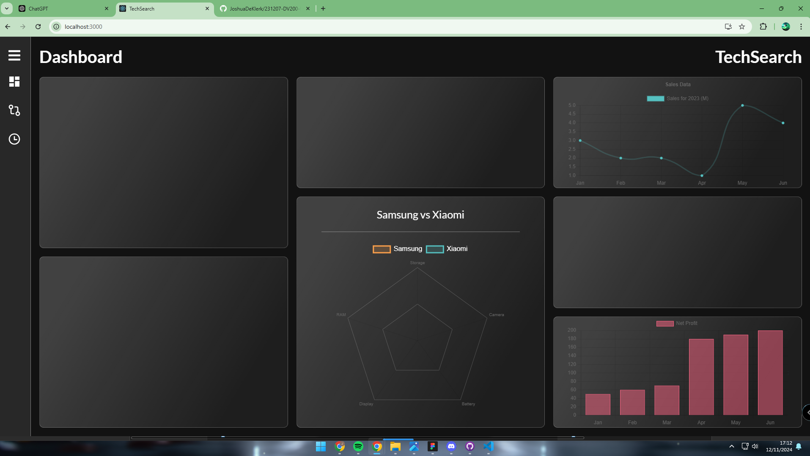
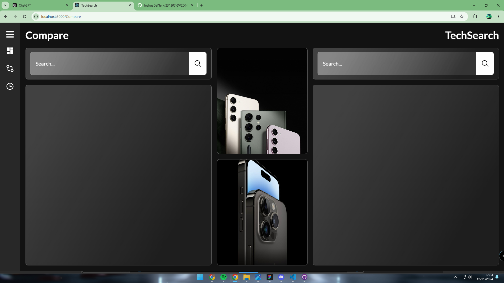
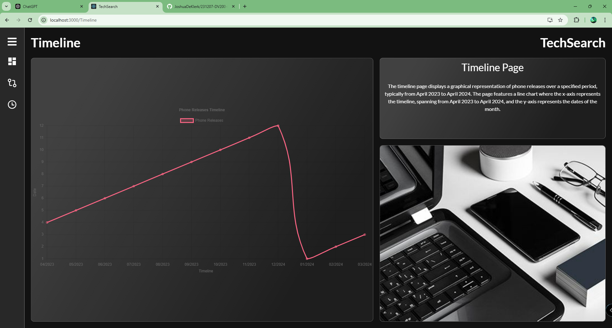

---

## Table of Contents

1. [About TechSearch](#about-techsearch)
2. [Built With](#built-with)
3. [How To Install](#how-to-install)
   - [Step 1: Clone the Repository](#step-1-clone-the-repository)
   - [Step 2: Setting Up the Environment](#step-2-setting-up-the-environment)
   - [Step 3: Firebase Setup](#step-3-firebase-setup)
   - [Step 4: Running the Project Locally](#step-4-running-the-project-locally)
4. [Features](#features)
5. [The Idea](#the-idea)
6. [Development Process](#development-process)
   - [Highlights](#highlights)
   - [Challenges](#challenges)
7. [Future Implementations](#future-implementations)
8. [Mockups](#mockups)
   - [Landing Page](#landing-page)
   - [Compare Page](#compare-page)
   - [Timeline Page](#timeline-page)
9. [Other Resources](#other-resources)
10. [License](#license)
11. [Author](#author)
12. [Contact](#contact)
13. [Acknowledgements](#acknowledgements)

---

# About TechSearch

TechSearch is a web application designed to help users compare and track the evolution of various technologies. With an intuitive user interface, users can search for specific tech products, compare features, and view timelines of product advancements.

### Built With
[](https://reactjs.org/)
[](https://html.spec.whatwg.org/multipage/)
[](https://developer.mozilla.org/en-US/docs/Web/CSS)
[](https://www.javascript.com/)
[](https://getbootstrap.com/)



## Getting Started

Follow these instructions to set up your copy of the project for development and testing.

### Prerequisites

Ensure you have the following installed:
- [Node.js](https://nodejs.org/)

### How to install

1. **Clone the repository**:
    ```bash
    git clone https://github.com/JoshuaDeKlerk/TechSearch
    ```

2. **Install frontend dependencies**:
    ```bash
    cd techsearch
    npm install react-scripts
    ```

2. **Start Development Server**:
    ```bash
    npm start
    ```

## Features

| Page             | Description                                                |
| ---------------- | ---------------------------------------------------------- |
| Dashboard Page     | Introduces users to the platform and allows tech searches. |
| Compare Page     | Enables comparison of features across multiple products.   |
| Timeline Page    | Displays the history and evolution of a chosen product.    |

## The Idea

TechSearch aims to simplify the process of comparing and learning about various tech products by providing a clean, functional interface that presents relevant information in a digestible format. The platform allows users to easily search for technology products, compare their features, and explore timelines of product evolution, making it an ideal tool for tech enthusiasts and informed buyers.

### DashBoard Page


### Compare Page


### Timeline Page


## Development Process

### Highlights
* **User-Friendly UI**: Designed with a clean and minimalist interface to ensure easy navigation and a positive user experience.
* **Real-Time Data**: Integrated api to allow real-time updates, ensuring that users have access to the latest information on technology products.

### Challenges
* **Api Management**: Ensured data consistency and real-time updates using TechSpecs Api.
* **Responsive Design**: Worked to make the layout and functionality accessible and consistent across different devices, ensuring a seamless experience on both mobile and desktop.

## Future Implementations

* **Enhanced Comparison Metrics**: Add more detailed features and specifications to give users a deeper level of comparison.
* **User Profiles**: Allow users to create accounts where they can save favorite products, comparisons, and timelines.
* **Social Sharing**: Enable users to share comparisons or timelines on social media platforms.
* **Customizable Filters**: Add advanced filters to allow users to narrow down results based on specific criteria like brand, release year, and price range.

## Mockups

### DashBoard Mockup


### Compare Mockup


### Timeline Mockup


## Other Resources

- **User Interface Inspiration** - [Pinterest Inspiration Board](https://pin.it/3OEehYU7C)
- **Branded Components Inspiration** - [Pinterest Components Board](https://pin.it/3j45LcXSX)
- **Demonstration Video** - [Link To Demonstration Video](https://drive.google.com/drive/folders/1IJ0_IzRdkvFpxXZKpwiYEPn-YkA6Mhau?usp=sharing)

## Author

- **Joshua De Klerk** - [Github](https://github.com/JoshuaDeKlerk)

## Contact

- **Joshua De Klerk** - [231204@virtualwindow.co.za](mailto:231204@virtualwindow.co.za)
- **Project Link** - https://github.com/JoshuaDeKlerk/TechSearch 

## Acknowledgements

- [Stack Overflow](https://stackoverflow.com/)
- [Figma](https://www.figma.com/)
- [Lecturer](https://github.com/TsungaiKats)
- [Pinterest](https://za.pinterest.com/)